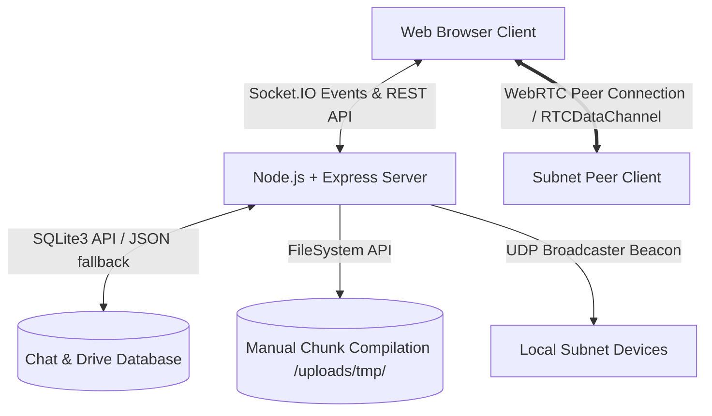
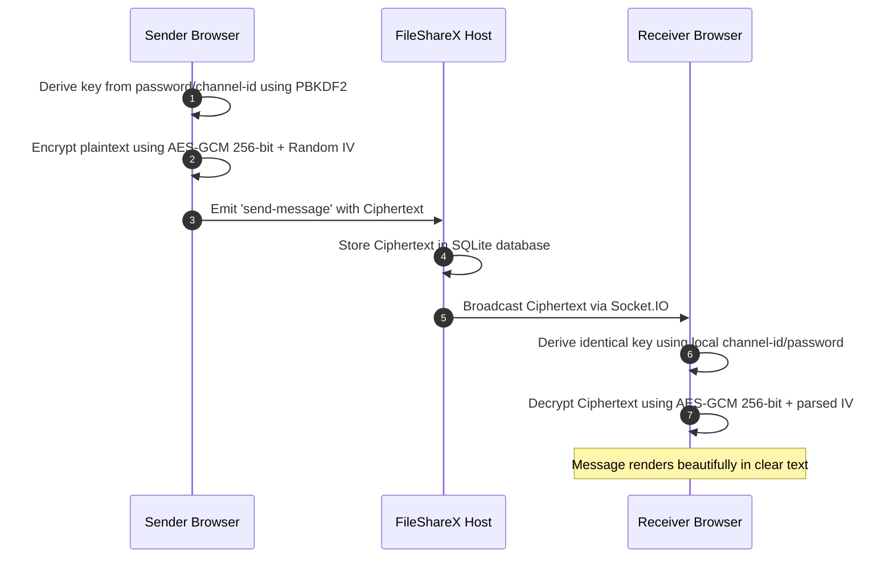
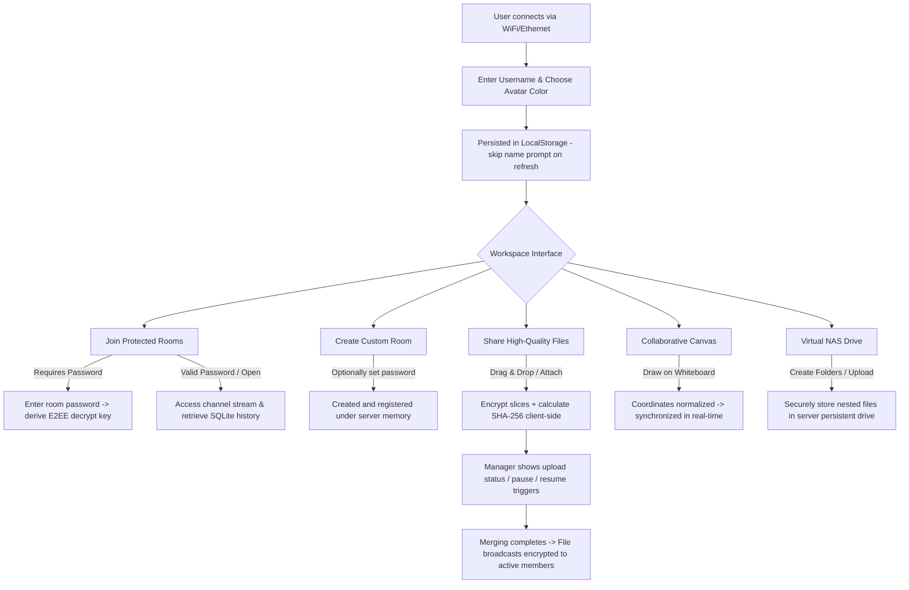

# 🌐 FileShareX

> **Premium, Ultra-Fast Offline Local-Network Chat, Encrypted Sharing & Collaborative Workspace**
>
> FileShareX is a futuristic, glassmorphic LAN-communication platform. It allows users connected to the same WiFi/Ethernet network to chat, make voice/video calls, draw together on a whiteboard, explorer a Virtual NAS drive, and securely share large files of any size without requiring an active internet connection.

---

## ✨ Features at a Glance

*   **🔒 Zero-Knowledge End-to-End Encryption (E2EE)**: Dual-Mode in-browser cryptographic pipeline. Utilizes native standard Web Crypto APIs (`PBKDF2` key derivation and 256-bit `AES-GCM`) in secure contexts (HTTPS/localhost). For insecure LAN HTTP contexts (such as external devices connecting via network IP `http://192.168.x.x:3000`), it automatically falls back to a high-performance pure-JS implementation utilizing **SHA-256 key-stretching** and a custom **CTR-SHA256 stream cipher**. All text messages, filenames, and chunked files are fully encrypted locally in the browser before ever leaving the device, ensuring absolute privacy on local subnets.
*   **📞 WebRTC Voice & Video Calling**: Real-time voice and video conferencing directly inside the active channel. Implemented using native browser media device streams and peer-to-peer connection protocols, with elegant fallback routines for audio-only streams when camera hardware is absent.
*   **⚡ P2P Direct ArrayBuffer File Transfers**: Transfer files directly from browser-to-browser with zero disk reads/writes on the server. Powered by WebRTC `RTCDataChannel`, with 16KB chunk slicing and active buffer congestion monitoring (1MB threshold) to prevent browser heap overflows.
*   **📡 Subnet LAN Auto-Discovery**: Offline automatic device discovery utilizing Node.js UDP socket beacons (`dgram` broadcasting on port `41234`) running every 4 seconds. Near active hosts on the local network are pruned after 12 seconds of inactivity and displayed instantly in a list to facilitate multi-device connections.
*   **🎨 Real-Time Synced Whiteboard**: Multi-user drawing canvas utilizing normalized float ratios (`x / width`, `y / height`) to guarantee identical, crisp scale rendering across disparate mobile, tablet, and desktop viewports. Features brush size selections, brush colors, and an eraser mode.
*   **🗄️ Virtual NAS LAN Drive Explorer**: A persistent nested directory explorer built on SQLite database models (with secure atomic JSON-file fallbacks). Files uploaded to the Virtual NAS inherit the E2EE chunking pipeline, meaning they are stored fully encrypted on the server disk!
*   **📂 Chunked Large File Uploads**: Upload files of any size (from 10 MB to 10 GB+) without memory leaks. Slices files into 1MB sequential chunks with real-time transfer progress, status monitoring, and instant pause/resume triggers.
*   **🛡️ Cryptographic Integrity Checks**: Client computes SHA-256 hashes sequentially (utilizing native Web Crypto API or highly optimized JS fallbacks for insecure HTTP environments) which are verified by the server before final compilation.
*   **💾 Robust SQLite & JSON Fallback History**: Fully persistent sqlite3 database stores all chat logs and share details. Fallback mechanism switches gracefully to a robust atomic JSON file structure if native compilation errors occur.
*   **🚀 Seamless Desktop Collapsible Sidebar**: Collapsible desktop sidebar using custom CSS variables and transition frameworks. Layout configurations (`sidebar-collapsed`) and usernames are stored in local browser state and restored on refresh.
*   **🎨 Premium Futuristic Glassmorphic Theme**: Dark Obsidian styling (`#04040a`), smooth micro-interactions, responsive mobile drawer, dynamic typing indicator, live user search, message removal, and host-creator room deletion.

---

## 🛠️ Technology Stack & Architecture



*   **Frontend**: Pure HTML5 (semantic layout), Vanilla CSS (harmonet HSL tokens, spring animations), and modular JavaScript. Zero external JS framework weight!
*   **Realtime Protocol**: WebSockets via `Socket.IO` for bidirectional user lists, channel listings, text events, typing notifications, whiteboard vector strokes, and WebRTC signalling coordinates.
*   **Backend Server**: Node.js and Express HTTP routing.
*   **Networking Broadcast**: Node `dgram` UDP socket broadcaster for LAN subnet discovery beacons.
*   **File Streaming**: Custom multer `memoryStorage` buffer handlers coupled with direct sequential stream writing (`fs.createWriteStream`) to avoid multi-gigabyte server RAM crashes.
*   **Database Schema**: SQLite (`database/chat.db`) storing usernames, message body, file type, file size, download URL, channel, virtual drive folders, and timestamp fields.

---

## 📦 Core Workflows & How They Work

### 1. Zero-Knowledge E2EE Message & File Pipeline
All privacy calculations occur entirely within the user's browser workspace.



---

## ⚙️ Setup & Configuration Guide

Setting up FileShareX on your local network is fast, clean, and requires zero cloud configuration.

### 📋 Prerequisites
Ensure you have the following installed on the host computer:
*   [Node.js](https://nodejs.org/) (Version 16.0 or higher)
*   [npm](https://www.npmjs.com/) (bundled automatically with Node.js)

### 💻 Step-by-Step Installation
1.  **Clone / Download this codebase** to your host computer:
    ```bash
    git clone https://github.com/arshad-muhammad/FileShareX.git
    cd FileShareX
    ```
2.  **Install lightweight dependencies**:
    ```bash
    npm install
    ```
    *This will install crucial modules: `express`, `socket.io`, `sqlite3`, `multer`, `qrcode`, and `ip`.*

3.  **Boot the platform**:
    ```bash
    node server.js
    ```

4.  **Confirm Launch**:
    Upon running, the server will output your primary LAN access address (e.g., `http://192.168.1.100:3000`) and boot up the SQLite chat database under `database/chat.db` seamlessly.

### ☁️ Hosting & Cloud Deployment

FileShareX is architected as a **stateful, high-performance, real-time Node.js application**. It relies on persistent WebSocket connections for chat syncing, active voice/video WebRTC coordination, and drawing board updates, combined with a local SQLite database (`database/chat.db`) and a dynamic filesystem workspace (`uploads/`) for handling large E2EE chunked uploads.

Because of this stateful architecture, **FileShareX cannot be hosted on Vercel or similar purely serverless hosting platforms**.

#### 🚫 Why Vercel is Not Supported

Vercel is designed for static websites and stateless serverless functions (like AWS Lambda). Attempting to deploy FileShareX on Vercel faces the following absolute barriers:
1. **No Persistent WebSocket Connections**: Vercel Serverless Functions have a strict execution timeout (usually 10 to 60 seconds). Once a function finishes returning an HTTP response, its execution context is frozen. Real-time, continuous bidirectional TCP/WebSocket connections via `Socket.IO` are impossible.
2. **Ephemeral and Read-Only Filesystem**: The container environment on Vercel is read-only (except `/tmp`). The SQLite database (`database/chat.db`) will fail when attempting to write chat logs or folders. Any uploaded files under `uploads/` will be completely wiped out the moment the serverless container recycles or scales down.
3. **No UDP Socket Broadcasting**: Vercel does not support raw UDP socket binding (`dgram` module), which is required to broadcast LAN auto-discovery beacons on port `41234`.
4. **No Chunked Compilation Storage**: The multi-gigabyte sequential chunk uploads pipeline compiles buffers on disk. Serverless environments cannot handle multi-step stateful compilations across separate HTTP function invocations without shared persistent storage.

#### 🚀 Recommended Cloud Hosting Providers

To deploy FileShareX to the cloud, you must use platforms that support **stateful, long-running Node.js processes** and provide **persistent disk volume attachments**:

##### 1. Render (Recommended / Free & Low-Cost)
[Render](https://render.com/) supports WebSockets out of the box and lets you mount a persistent volume disk for your database and uploads.
* **Service Type**: Web Service
* **Runtime**: Node.js
* **Build Command**: `npm install`
* **Start Command**: `node server.js`
* **Storage Volume**: Mount a persistent volume at `/database` and `/uploads` to keep your SQLite chat history and files persistent.

##### 2. Railway
[Railway](https://railway.app/) is an excellent, developer-friendly platform that runs full Docker/Node containers with persistent disk support.
* Deploys directly from your GitHub repository.
* Attach a persistent volume to preserve SQLite and upload directories.
* Seamless automatic SSL provision for secure contexts (enabling native Web Crypto API).

##### 3. Fly.io
[Fly.io](https://fly.io/) runs physical micro-VMs in regions close to your users, making real-time signaling extremely fast.
* Supports custom ports and protocols (including UDP if needed).
* Easily scale app containers and attach high-performance persistent volumes.

##### 4. VPS (Virtual Private Server) / Self-Hosted (Highly Recommended)
Deploying on a Virtual Private Server (DigitalOcean, Linode, AWS EC2) or local hardware (Raspberry Pi, home server) gives you absolute control over networking, maximizing transfer speeds since traffic remains purely local/LAN without external internet bottlenecks.

---

## 👥 Interactive User Flow

The typical journey of a user interacting with the FileShareX local network workspace is outlined below:



---

## 📽️ Application Walkthrough

### 1. Connecting Your Network Devices
1.  On starting the server, you will see a **Network Stats Badge** in the top left corner of the sidebar, indicating your network interface status (e.g., `Local Network Active` with a breathing green pulse).
2.  Click the network stats card. A sleek glassmorphic **Connect Mobile or Other Devices** modal will fade in.
3.  Scan the dynamically generated **QR Code** using your smartphone, tablet, or secondary laptop connected to the same LAN WiFi.
4.  **Auto-Discovery Connects**: If there are other FileShareX instances running on your LAN subnet, they are discovered automatically and drawn inside the **Subnet Discovery Connect List** at the bottom of the Connect Modal. Simply click the "Connect" button next to any peer host card to open their dashboard!

### 2. Zero-Knowledge E2EE Setup
1.  If it is your first time entering, you are welcomed by the **Join Local Network Chat** modal.
2.  Enter your display name. FileShareX allocates a vibrant user color to you and saves your name to your browser's local state.
3.  **Encrypted Message Keys**: If you are inside `#general`, a default key is derived under the hood. If you create or join a password-protected room:
    *   The password you enter is used as the key material for key derivation via PBKDF2.
    *   All messages and files shared in this room are encrypted using this derived key. Eavesdroppers without the password cannot read your chat logs!

### 3. Voice & Video Calls
1.  Locate the video camera button in the room header, and click it.
2.  The glassmorphic **Voice & Video Chat** conference panel will scale in.
3.  Your browser will prompt for camera and microphone access. Upon confirmation, your local stream will display instantly. If your device has no camera or it is blocked, FileShareX falls back gracefully to microphone audio-only capture!
4.  As other peers in the room click the video button, their local connections are negotiated dynamically and their streams appear in a sleek responsive layout grid.
5.  Use the controls in the call header to toggle microphone mute statuses, enable/disable your camera, or disconnect completely.

### 4. Collaborative Canvas
1.  Click the paintbrush icon in the room header.
2.  The **Sketch Drawing Canvas** panel will open.
3.  Select a brush size (Thin, Medium, Thick, Huge) and pick your favorite hex color from the inline color picker.
4.  Draw freely using your mouse on desktop or touch gestures on mobile devices.
5.  All strokes are normalized immediately and transmitted via Socket.IO, mirroring your drawing in real-time on your room members' canvases.
6.  Click the eraser button to clear local strokes, or hit the trash can icon to clear the canvas for everyone in the room.

### 5. Virtual NAS LAN Drive
1.  Click the folder database button in the room header.
2.  The **Virtual Drive** manager panel will open.
3.  **Create Directories**: Click **New Folder** to build nested folders.
4.  **Upload Persistent Files**: Click **Upload File** to choose local files. The files will pass through our chunking and encryption pipelines, ensuring they are stored fully encrypted in the server's drive repository.
5.  **Interactive Navigation**: Double-click folders to navigate deeper, and use the breadcrumbs at the top of the explorer to click and return back.
6.  **Download, Preview, and Delete**: Use action buttons on the right of any file row to preview supported formats (images, videos, PDFs) inside a secure decrypted viewer, download the file, or delete it permanently from the host storage.

---

## 🔒 Security & Privacy Notes

*   **Zero-Knowledge local cryptos**: Chat histories, filenames, and binary files are encrypted in-browser before leaving your machine. The host server holds only raw ciphertext arrays and cryptographic IVs.
*   **Subnet-restricted operation**: All data, streams, calls, and discover beacons are confined to your local network card interfaces. No data leaks to third-party cloud relays.
*   **Buffer overflow protection**: High-performance direct transfers restrict WebRTC channel chunks to 16KB, dynamically polling `bufferedAmount` to ensure seamless low-latency streams without device freeze-ups.

---

## 📄 License
This project is licensed under the MIT License. Feel free to copy, modify, and build upon FileShareX to fit your home and organizational networking needs!
